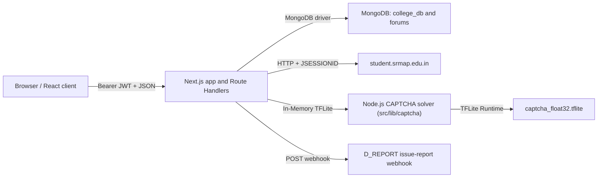

# Srmapi Next

Srmapi Next is a full-stack alternative portal for SRM AP students. It is a Next.js 16 application with a React client, Next.js Route Handlers as its backend, MongoDB for application data, and an in-house Node.js TFLite CAPTCHA solver. The backend signs in to `student.srmap.edu.in` on a student's behalf, keeps the SRM `JSESSIONID` in the browser for the current session, scrapes portal pages, normalizes the results, and caches selected data in MongoDB.

It is a third-party integration, not an official SRM service. SRM may change its HTML, session behavior, CAPTCHA format, or policies at any time; every scraper depends on the current portal markup.

## Contents

- [System map](#system-map)
- [Prerequisites and local setup](#prerequisites-and-local-setup)
- [How a login and data refresh work](#how-a-login-and-data-refresh-work)
- [Frontend](#frontend)
- [Backend API](#backend-api)
- [SRM scraper and CAPTCHA service](#srm-scraper-and-captcha-service)
- [Database and cache model](#database-and-cache-model)
- [Authentication, credentials, and security](#authentication-credentials-and-security)
- [Configuration, deployment, and operations](#configuration-deployment-and-operations)
- [Complete source map](#complete-source-map)

## System map



The browser never calls SRM directly. `src/lib/api/axiosClient.ts` adds the active account's JWT from local storage to every `/api` request. Route handlers authenticate that token, then use the supplied SRM session ID to make portal requests. The initial dashboard fetch also writes encrypted portal data to MongoDB so users can choose cached data when SRM is unavailable.

## Prerequisites and local setup

Use Node.js 22 or a current Node release supported by Next.js 16, and a reachable MongoDB instance. (No Python dependency required).

```bash
npm install
```

Create a `.env` file in the repository root.

```dotenv
NODE_ENV=development
MONGO_URI="mongodb://127.0.0.1:27017"
FORUMS_MONGO_URI="mongodb://127.0.0.1:27018"
ACCESS_SECRET="replace-with-a-long-random-signing-secret"
ACCESS_EXPIRE=365
D_REPORT="https://example.invalid/webhook"
```

Start the application:

```bash
npm run dev
```

The web application runs on the Next.js development port (normally `http://localhost:3000`).

Available npm commands:

| Command | What it does |
| --- | --- |
| `npm run dev` | Starts Next.js development mode. |
| `npm run build` | Creates a production build using webpack. |
| `npm run start` | Serves the production build on port 3000. |
| `npm run lint` | Runs the configured Next/ESLint command. |
| `npm run faculty` | Converts `scripts/faculty/faculty.xlsx` to `src/static/faculty.json`. |
| `npm run benchmark` | Runs the CAPTCHA solver performance & throughput benchmark. |

## How a login and data refresh work

1. The login page validates the registration number locally and sends `{ username, password, wantCachedData }` to `POST /api/auth/login`.
2. The handler uppercases and validates the registration number, rejects blocked users, and calls `handleUserSession`.
3. `src/server/auth/login.ts` loads SRM's login page, extracts `JSESSIONID` from `Set-Cookie`, downloads the CAPTCHA, solves it using the cached in-house TFLite model in `src/lib/captcha`, and posts the username, password, and predicted CAPTCHA to SRM. A missing `<h2>` in SRM's response is treated as failed login.
4. On success, the `JSESSIONID` is encrypted with the user password and written to `college_db.users`, with an India-time session date. The API returns a signed JWT plus the plain session ID and time to the browser.
5. The React `StudentDataProvider` calls `POST /api/srmapi/fetch` while the session date is current. It requests SRM's dashboard, attendance, timetable, subject, profile, and CGPA fragments concurrently, parses them with Cheerio, saves the result encrypted in MongoDB, saves at most ten daily encrypted attendance snapshots, and returns normalized data to the client.
6. The client stores the response data, session ID, and JWT in the active account record in browser `localStorage`; it populates the dashboard, attendance, timetable, profile, and subjects screens from that state.
7. If SRM is unreachable during a manual login and an encrypted database session can be decrypted with the entered password, the user is offered cached data. Cached mode sends no SRM session ID; `/api/srmapi/fetch` decrypts and returns stored data instead.
8. On a new day, `needsRefresh` causes the client to call `GET /api/srmapi/initiate/session`. The route reads the username and password from the JWT, logs into SRM again, updates the active account, and refreshes data.

Session validity is date-based, not a precise SRM expiry check: `isSessionValid` considers an India-time `yyyy-MM-dd` session timestamp valid only for the current calendar day.

## Frontend

The App Router root layout installs global CSS, analytics, toast notifications, a route progress indicator, error boundaries, and the provider tree:

`LocalStorageProvider -> AuthProvider -> StudentDataProvider -> ThemeProvider -> application`.

Authentication is client-side route gating. The public layout redirects a locally authenticated visitor to their selected startup page. The protected layout redirects unauthenticated visitors to `/login`, but permits unauthenticated access to `/`, `/privacy`, `/terms`, and `/aboutus` even though those files live under the protected route group. It displays the fetch loader until `StudentDataProvider` initializes.

### Browser storage and account switching

`settings` and `profile` are JSON values in `localStorage`.

- `settings` stores theme, sidebar visibility, timetable display preference, attendance sort preference, tutorial/explanation flags, and startup page.
- `profile.accounts` holds up to five accounts. Each account has `id`, `username`, `accessToken`, `sessionId`, `sessionTime`, `hasCachedData`, and client-side `data`.
- Legacy single-account values are migrated into `accounts` on startup. The active account is copied to the top-level compatibility fields.
- Switching accounts changes the active record and runs the student-data initialization again. Logging out removes only the active local account; it does not call an SRM logout endpoint or delete MongoDB data.

### Pages

| URL | Source | Function |
| --- | --- | --- |
| `/` | `(public)/page.tsx` | Marketing/landing page. |
| `/login` | `(public)/login/page.tsx` | Validates registration number, runs the login flow, and can accept cached-data fallback. |
| `/forgot` | `(public)/forgot/page.tsx` | SRM password-reset OTP initiation and password-change UI. |
| `/dashboard` | `(protected)/dashboard/page.tsx` | Attendance warnings, current/next class, timetable preview, and student summary. |
| `/attendance` | `(protected)/attendance/page.tsx` | Subject attendance, sorting/filtering, simulation, OD/ML adjustment, history, and detailed current attendance. |
| `/markattendance` | `(protected)/markattendance/page.tsx` | Sends an attendance code to SRM. |
| `/checkattendance` | `(protected)/checkattendance/page.tsx` | Displays SRM's current-day attendance records. |
| `/timetable` | `(protected)/timetable/page.tsx` | Weekly timetable, subject lookup, current-class logic, and subject dialog. |
| `/subjects` | `(protected)/subjects/page.tsx` | Displays scraped enrolled subjects and links to the published subject sheet. |
| `/cgpa` | `(protected)/cgpa/page.tsx` | Client-side CGPA calculator. |
| `/exams/internals` | `(protected)/exams/internals/page.tsx` | Fetches current internal assessment marks. |
| `/exams/past-internals` | `(protected)/exams/past-internals/page.tsx` | Lists historical semesters and fetches a selected semester's marks. |
| `/exams/semester-results` | `(protected)/exams/semester-results/page.tsx` | Displays parsed exam ledger rows and CGPA. |
| `/feedback` | `(protected)/feedback/page.tsx` | Retrieves SRM feedback subjects, proposes a random comment, and submits ratings/comments. |
| `/vacant` | `(protected)/vacant/page.tsx` | Queries available rooms by block, day, and time slot. |
| `/resources` | `(protected)/resources/page.tsx` | Walks static course/year/subject resource data through protected APIs. |
| `/calender` | `(protected)/calender/page.tsx` | Renders the static academic calendar (the route spelling is `calender`). |
| `/forums` | `(protected)/forums/page.tsx` | Paged/searchable forum listing. |
| `/forums/create` | `(protected)/forums/create/page.tsx` | Creates a forum post. |
| `/forums/[id]` | `(protected)/forums/[id]/page.tsx` | Post, comments, post closure, answer pinning, and admin deletion. |
| `/profile` | `(protected)/profile/page.tsx` | Displays scraped student profile data. |
| `/settings` | `(protected)/settings/page.tsx` | Theme/startup settings, local accounts, refresh, issue report, database-document viewer, and data deletion. |
| `/admin` | `(protected)/admin/page.tsx` | Admin metrics, blocked-user list, notifications, and feedback controls. |
| `/apps` | `(protected)/apps/page.tsx` | App/download presentation. |
| `/aboutus`, `/privacy`, `/terms` | protected route group | Public informational/legal pages. |

`DashboardLayout.tsx` is the shared navigation shell: desktop/mobile sidebars, top controls, account switching, theme controls, and navigation items. `components/page/*` contains the feature-specific dialogs/cards; `components/ui/*` is the reusable Radix/Tailwind component layer; `hooks/*` contains UI state helpers (toasts, mobile detection, password visibility, session validation, current class, timetable subject maps/dialogs, and scroll indicator).

## Backend API

All API responses are JSON. With the exception of `POST /api/auth/login` and `POST /api/auth/forgot`, every endpoint below requires `Authorization: Bearer <accessToken>`. `requireAuthResponse` verifies the token and then checks the MongoDB blocked-user collection. Most error helpers return `{ success: false, message, ...extra }`; authentication/session failures often include `action: "logout"`, which the Axios interceptor uses to remove the active local account.

### Authentication and account data

| Method and route | Body/query | Behavior |
| --- | --- | --- |
| `POST /api/auth/login` | `username`, `password`, optional `wantCachedData` | Validates, checks blocking, logs in to SRM, upserts encrypted SRM session, and returns JWT/session details. If SRM is unavailable and cached data can be decrypted, returns/permits cached mode. |
| `POST /api/auth/forgot` | `type: "initiate"|"change"`, `username`; plus `newpass`, `otp` for change | `initiate` solves SRM CAPTCHA and asks SRM to send OTP. `change` validates new password and posts OTP/password to SRM's reset resource. |
| `DELETE /api/auth/delete` | `reason` | Requires a non-empty reason, then deletes this user's `college_db.users` document. The reason is validated but not saved. |
| `GET /api/srmapi/initiate/session` | none | Re-authenticates against SRM using JWT claims and returns a new session ID/date. |
| `POST /api/srmapi/fetch` | optional `sessionId` | With valid current session plus ID, scrapes SRM, encrypts and stores normalized data, records daily attendance history, and adds timetable input for vacancy generation. Without an ID, decrypts and returns cached DB data when the state allows it. |
| `GET /api/tools/document` | none | Returns the requesting user's complete MongoDB user document excluding `_id`; the settings UI exposes it. |

### SRM attendance, marks, and feedback

| Method and route | Body | Behavior |
| --- | --- | --- |
| `POST /api/srmapi/attendance/details` | `sessionId` | Scrapes SRM's current-day attendance (`ids=33`) and returns rows plus a display timestamp. |
| `GET /api/srmapi/attendance/history` | none | Lists prior stored attendance snapshot dates only; today's snapshot is omitted. |
| `POST /api/srmapi/attendance/history` | `date`, optional `password` | Decrypts one historical snapshot using provided password or JWT password. It returns `PASSWORD_REQUIRED` or `INVALID_PASSWORD` on decryption failure. |
| `POST /api/srmapi/attendance/mark` | `sessionid`, `code` | Posts the attendance code to SRM with zeroed latitude/longitude and translates SRM result text. |
| `POST /api/srmapi/exams/internals` | `sessionId` | Scrapes current internal marks. |
| `POST /api/srmapi/exams/past-internals` | `sessionId`, optional positive integer `semester` | Lists available historic semesters; with a semester also returns that semester's marks. |
| `POST /api/srmapi/exams/semester-results` | `sessionId` | Scrapes the exam ledger and CGPA. |
| `GET /api/srmapi/feedback/comment` | none | Selects a random static feedback comment. |
| `POST /api/srmapi/feedback/subjects` | `sessionId` | Scrapes feedback subjects/faculty metadata; reports no subjects when feedback is already submitted. |
| `POST /api/srmapi/feedback/submit` | `sessionId`, `comment`, `optionNo`, optional `selectedSubjectIds` | Checks feature toggle and current session, builds rating/descriptive-answer payloads for up to the first 20 rating and first 5 textarea questions per selected SRM subject, submits them concurrently, and increments feedback count if any succeeds. |

### Static data, rooms, notifications, and reporting

| Method and route | Input | Behavior |
| --- | --- | --- |
| `GET /api/resources/courses` | `?year=` | Returns course data for a static year key. |
| `GET /api/resources/subjects` | `?course=&year=` | Returns static subject data for a course/year. |
| `GET /api/resources/resource` | `?course=&year=&subjectId=` | Returns static resource payload for one subject. |
| `GET /api/vacant` | `?block=&day=&slot=` | Ensures empty-room JSON is current, reads a requested slot, and enriches each room with a type from `ROOM_TYPES`. |
| `GET /api/sync` | none | Returns notifications and synced user settings from database. |
| `POST /api/sync` | `settings` | Updates synced user settings in database and returns updated settings and notifications. |
| `POST /api/tools/report` | `title`, `reason`, optional `time`, optional `id` | Checks title and user existence, then posts an embed to `D_REPORT`. Accepted titles are `Bug`, `Feature Request`, `UI Issue`, `Contact`, and `Error`. |

### Forums

| Method and route | Input | Behavior |
| --- | --- | --- |
| `GET /api/forums/categories` | none | Lists forum categories alphabetically. |
| `GET /api/forums/load` | optional `limit`, `search`, `lastCreatedAt`, `lastId` | Lists posts newest-first; search uses case-insensitive regex over title, description, and username. Cursor pagination applies when no search is supplied. |
| `POST /api/forums/create` | `title`, `description`, `category` | Validates required values, max 256/2048 lengths, validates category ObjectId, and creates an open post. |
| `GET /api/forums/[id]` | path ID | Returns one post and its comment count. |
| `DELETE /api/forums/[id]` | path ID | Admin-only; transactionally deletes post and all comments. |
| `GET /api/forums/[id]/comments` | path ID | Lists comments newest-first. |
| `POST /api/forums/[id]/comments` | `content` | Requires an open post and non-empty content of at most 2048 characters, then creates a comment. |
| `PATCH /api/forums/[id]/status` | `status: "open"|"closed"` | Allows post owner or admin to change post status. |
| `PATCH /api/forums/[id]/pin` | `commentId` | Allows post owner or admin to make one comment the pinned answer; clears other pinned flags. |

### Administration

The admin allowlist is hard-coded in `isAdmin` in `src/server/utils/functions.ts`; being an admin is also embedded as `admin: true` in the issued JWT. Admin routes additionally validate the token and call the hard-coded allowlist.

| Method and route | Body | Behavior |
| --- | --- | --- |
| `GET /api/admin/check` | none | Confirms admin authorization. |
| `GET /api/admin/details` | none | Returns total/current-day user counts, registrations today, feedback count, feedback flag, blocked users, and notifications. |
| `POST /api/admin/block/add` | `username` | Uppercases username; blocks an existing non-admin user and records actor/time. |
| `POST /api/admin/block/remove` | `username` | Removes a blocked-user entry. |
| `POST /api/admin/notification/add` | `notification` | Creates an admin notification and retains only the newest ten. |
| `POST /api/admin/notification/remove` | `notificationId` | Removes one notification by ObjectId. |
| `POST /api/admin/settings/feedback/toggle` | none | Main-admin-only endpoint; toggles `settings/{id: "app-settings"}.feedback`. |
| `POST /api/admin/settings/feedback/reset` | none | Main-admin-only endpoint; sets `settings/{id: "feedback"}.count` to zero. |

## SRM scraper and CAPTCHA service

### Portal requests and parsers

`createClient(sessionId)` creates an Axios client with an 8-second timeout, HTTP/HTTPS keep-alive agents, browser-like headers, and `Cookie: JSESSIONID=<sessionId>`. The header builders in `src/server/utils/headers.ts` supply separate main-page, CAPTCHA, authenticated, and basic request headers.

`fetchFromWebsite` posts the SRM report resource with IDs `3` (attendance), `10` (timetable), `2` (subjects), `1` (profile), and `6` (CGPA), while also loading `HRDSystem` for profile picture data. It parses:

- Attendance: code, name, conducted/present/absent counts, OD/ML counts and percentages, and total percentage.
- Timetable: first five data rows as weekdays; later rows as subject details.
- Subjects: semester/credit lookup, subject name, LTP, faculty, classroom, and optional faculty-cabin matches from `faculty.json`.
- Profile: name, registration number, institution, semester, program, section, specialization, DOB, gender, and SRM profile-picture URL.
- CGPA: text from SRM's CGPA display.

Exam helpers parse report IDs `5` (current internals), `6` (exam ledger), `22` (available earlier internal semesters), and `23` (a chosen earlier semester). The attendance-detail helper posts `ids=33`. Feedback first reads `subjectwisefeedback.jsp` with `ids=9`, then loads/submits individual forms through `subjectwisefeedbackresources.jsp`.

### CAPTCHA solver

The CAPTCHA solver is implemented in Node.js within `src/lib/captcha/captcha.ts`. It loads the TFLite model from `src/static/captcha/model/captcha_float32.tflite` once at application startup or initial login request and caches the model instance in memory. 

When a CAPTCHA buffer is passed to `solveCaptcha`:
1. `sharp` crops the image to `(0, 0, 120, 25)` and converts it to grayscale.
2. Normalized float values (`0..1`) are reshaped into a `[1, 25, 120, 1]` tensor.
3. The cached TFLite model runs inference, and predictions are mapped to `A-Z, 0-9`.

Because the model is cached in memory, each CAPTCHA solve takes ~2ms within Node.js, eliminating external network/HTTP overhead.

## Database and cache model

MongoDB has two logical databases.

| Database / collection | Written/read by | Stored fields and purpose |
| --- | --- | --- |
| `college_db.users` | login, fetch, attendance history, tools document, deletion | `username`, `name`, `createdAt`, `session_id` (encrypted SRM ID), `session_time`, `data` (encrypted normalized portal payload), and up to 10 `{ date, data }` encrypted attendance snapshots. |
| `college_db.blocked` | auth guards/admin | `username`, `blockedAt`, `blockedBy`; used on login and every protected API call. |
| `college_db.notifications` | admin/tools | notification text, creation time, author; public notification response hides ID/author. |
| `college_db.settings` | feedback/admin | `{ id: "app-settings", feedback }` and `{ id: "feedback", count }`. Seed these documents before using the feedback toggle/reporting UI. |
| `college_db.empty_classes` | fresh data fetch/vacancy generator | SHA-256-deduplicated timetable/profile data used to calculate occupied rooms. |
| `forums.data` | forum routes | posts: author, title, description, category name, timestamps, `status`, and optional pinned-answer metadata. |
| `forums.comments` | forum routes | `postId`, author, content, timestamps, and optional `isPinned`. |
| `forums.categories` | forum routes | category documents; create-post expects the document ObjectId. |

Vacancy generation supports the hard-coded C-block rooms and eight daily slots from 09:00 through 16:50, Monday to Friday. It scans each stored timetable for venue text matching `(BlockRoom)`, marks those rooms occupied, and writes `src/static/empty_classrooms.json`. `ensureVacantFresh` generates the file when missing and refreshes it once per India-time day after 01:00; the module-global running promise prevents duplicate work inside one Node process. The output file is ignored by Git.

### Multiple MongoDB databases

The application uses two MongoDB connections:

| Connection | Environment Variable | Purpose |
| --- | --- | --- |
| Main Database | `MONGO_URI` | Stores application data such as users, authentication, cached SRM data, notifications, and other core collections. |
| Forums Database | `FORUMS_MONGO_URI` | Stores all forum-related collections, including posts, comments, reactions, categories, and other forum-specific data. |

The backend maintains separate MongoDB client instances for each connection. Only the forum API routes use `FORUMS_MONGO_URI`; all other APIs continue using `MONGO_URI`. This separation allows the forums to be hosted, scaled, backed up, or migrated independently without affecting the main application database.

## Authentication, credentials, and security

### Current credential design

This project intentionally includes the SRM password in the JWT payload:

```ts
createToken({ username, password, admin: isAdmin(username) })
```

This is required by the current design because `/api/srmapi/initiate/session` needs credentials to re-login to SRM, and encrypted database data/session IDs use the same password as their decryption secret. `ACCESS_SECRET` signs the JWT and `ACCESS_EXPIRE` sets its lifetime in days.

Important distinction: a standard signed JWT is encoded, not encrypted. Anyone who obtains the token can Base64-decode its claims and read the password; anyone who obtains it can also use it as a bearer token until it expires. The frontend writes the token to `localStorage`, so an XSS vulnerability, a compromised browser profile/extension, or local-device access can expose both SRM credentials and authenticated API access. Treat an access token exactly like a password.

### Cache cryptography

The server encrypts session IDs, normalized portal data, and attendance history using AES-256-CBC. It derives a 32-byte key from the SRM password with PBKDF2-SHA-256, 100,000 iterations, and a fresh 16-byte salt; a fresh 16-byte IV and the salt are concatenated with the ciphertext and Base64 encoded. This provides at-rest confidentiality only while the password remains unavailable. CBC does not supply an authentication tag, so it is not authenticated encryption.

### Existing controls

- Bearer-token signature/expiry validation on protected API routes.
- User blocklist checked on login and protected requests.
- Hard-coded server-side admin allowlist, with additional main-admin checks on the feedback controls.
- Login registration-number validation, password-reset password validation, and length/object-ID checks on most forum/admin inputs.
- MongoDB transaction for coordinated forum post/comment deletion.
- Request timeouts for portal Axios clients and CAPTCHA inference.
- Error responses can signal the client to remove its active local account.

### Known limitations

- Do not log request bodies, JWTs, passwords, session IDs, or decrypted cache data.
- There is no server-side token revocation, CSRF strategy, rate limiter, account lockout, or database schema/index setup in the current source. JWT expiry is the normal token-lifetime boundary; blocking is the available server-side access denial.
- Forum search creates a regex from user input. It should be escaped and limits should be bounded before exposing the service broadly.
- `POST /api/tools/report` permits `body.id` to replace the ID displayed in the report embed; it does not change the authenticated user check.
- Scraper, feedback, and attendance submission endpoints act with a user's SRM session. Obtain consent and ensure this use complies with SRM's rules.

## Configuration, deployment, and operations

`next.config.ts` enables React strict mode outside development, disables dev indicators, skips TypeScript build errors only in development, and configures Serwist only in production. The production Serwist configuration writes `public/sw.js` from `src/app/sw.ts`, but currently excludes every match from precaching. `public/manifest.json`, icons, `robots.txt`, and `src/app/sitemap.ts` provide PWA/discovery metadata.

For production, run MongoDB, build the application with `npm run build`, and serve it with `npm run start` behind a reverse proxy. Ensure the application can communicate with SRM. If the runtime filesystem is ephemeral, configure a persistent writable location for generated vacancy data, as the application writes it under `src/static`.

## Complete source map

This inventory covers every tracked project source/configuration area. Generated dependency folders, `.next`, local environment files, Git internals, and the archived ZIP are intentionally not application source.

| Path/group | Responsibility |
| --- | --- |
| `src/app/layout.tsx`, `globals.css`, `error.tsx`, `not-found.tsx`, `loading` files, `sitemap.ts`, `sw.ts` | Root document/providers/styles, global error/not-found/loading UX, sitemap, and service-worker source. |
| `src/app/(public)/*` | Landing, login, forgot-password pages and authenticated-user redirect layout. |
| `src/app/(protected)/*` | All authenticated app pages listed in the frontend table, their loading layout, and admin sub-layout. |
| `src/app/api/auth/*` | Login, SRM password reset, and user-document deletion. |
| `src/app/api/srmapi/*` | Session initiation, aggregate portal fetch, attendance, examinations, and feedback endpoints. |
| `src/app/api/forums/*` | Categories, post listing/creation/read/deletion, comments, status, and pinned answer endpoints. |
| `src/app/api/admin/*` | Admin verification, metrics, blocks, notifications, and feedback settings. |
| `src/app/api/resources/*`, `api/vacant`, `api/tools/*` | Static learning resources, room availability, user document, notifications, and issue reporting. |
| `src/static/captcha/*` | Captcha TFLite model (`src/static/captcha/model/captcha_float32.tflite`) and path definition. |
| `src/lib/captcha/*` | In-house Node.js TFLite captcha solver module with in-memory caching and sharp preprocessing. |
| `src/server/auth/*` | SRM login exchange, encrypted session persistence/cached-login fallback, and bearer-token extraction. |
| `src/server/srmapi/fetchData.ts` | Concurrent SRM report fetch and Cheerio normalization of dashboard data. |
| `src/server/srmapi/exams/*` | SRM HTML parsers and per-user session-validity wrappers for internals, past internals, and ledger results. |
| `src/server/srmapi/feedback/*` | Feedback subject parser, static random comment reader, answer construction, and SRM submission. |
| `src/server/srmapi/utils/*` | Timetable projection for vacancy data and current-day attendance parser. |
| `src/server/utils/*` | SRM headers/agents, API error helpers, JWT/auth/crypto/retry functions. |
| `src/server/faculty/faculty.ts` | Normalizes faculty names and looks up cabin locations in static faculty data. |
| `src/server/vacant/*` | Builds and freshness-controls the empty-classroom matrix. |
| `src/context/*` | React contexts for auth, browser storage/accounts, student data, theme, and admin state. |
| `src/hooks/auth`, `hooks/context`, `hooks/timetable`, `hooks/utils` | Session/auth/storage helpers, timetable mapping/current-class/dialog state, toasts, notifications, mobile/scroll/password UI hooks. |
| `src/lib/api/axiosClient.ts` | Browser API client, JWT injection, and forced-logout/blocked-response handling. |
| `src/lib/database/*` | Singleton MongoDB connector and its alias. |
| `src/components/layouts/*` | Dashboard navigation shell (`DashboardLayout.tsx`) and modular layout sub-components (`src/components/layouts/dashboard/`). |
| `src/components/client/*` | Analytics, route progress, and loading UI. |
| `src/components/page/*` | Attendance dialogs/card, feedback info dialog, landing/download components, settings report form, and timetable subject dialog. |
| `src/components/utils/*` | React error boundary, cache prompt, and session card. |
| `src/components/ui/*` | Reusable Tailwind/Radix primitives: alert, avatar, badge, button, checkbox, dialog, drawer, dropdown, input, label, scroll area, select, separator, sheet, sidebar, skeleton, switch, tabs, textarea, toast/toaster, toggle, tooltip, warning box. |
| `src/shared/*` | Client-safe API retry helper; attendance, time/session, password, timetable, forum-color, message, and class-name utilities. |
| `src/validators/*` | Registration-number, reset-password, and feedback-comment validation. |
| `src/types/*` | Type definitions for student context, login, feedback, and room type metadata. |
| `src/static/*` | Academic calendar, feedback phrases, faculty cabins, resources, and generated vacancy JSON. |
| `public/*` | PWA icons/manifest, robots instructions, screenshots, developer images, and gender avatar fallbacks. |
| `scripts/faculty/*` | Faculty spreadsheet input and Node converter that regenerates faculty JSON. |
| `deprecated/*` | Old Next.js Omegle page and standalone websocket prototype; they are not imported by the current application. |
| `package.json`, `next.config.ts`, `tsconfig.json`, `tailwind.config.ts`, `postcss.config.js`, `eslint.config.ts` | Build scripts/dependencies and Next/TypeScript/Tailwind/PostCSS/ESLint configuration. |
| `.gitignore`, `next-env.d.ts`, `temp.txt` | Ignore rules, Next TypeScript declaration, and an unreferenced temporary text file. |

## Development checklist

Before changing a feature, trace the UI page to its `API` call, the matching route handler, and the server helper/parser it calls. When SRM changes, update the parser selectors and validate login, aggregate fetch, attendance, internals, results, and feedback against a permitted test account. When the data model changes, update the MongoDB document viewer/types and retain the ability to decrypt existing encrypted data, or plan a migration. Changes to the JWT payload or encryption scheme may require updates to session re-authentication and cached-data compatibility.